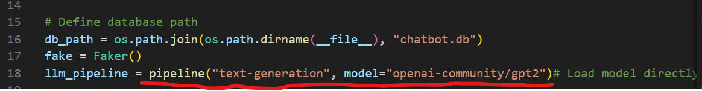
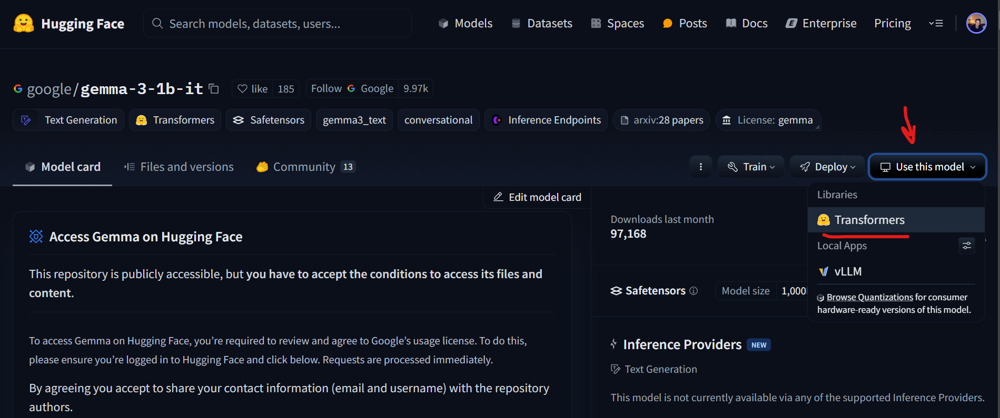
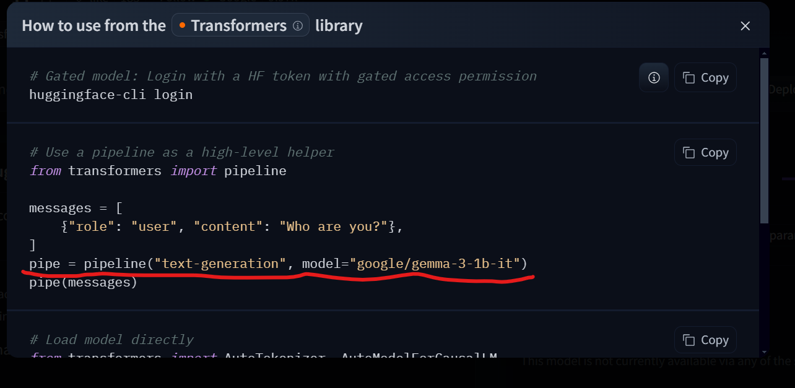

# Atlas Project

### First Time Set Up

Pull down your main repo branch by syncing local and remote hosts

Create venv and install packages:
`python -m venv venv`

`cd venv/Scripts`

`activate`

`cd ../..`

`pip install -r  requirements.txt`

### First Time Set Up

Set up the backend and the front end so the app is deployed:

Frontend:
`cd frontend`
`npm run dev`

Backend:
`cd backend`
`python manage.py runserver`

Now to play around with models you will need the following active:
HuggingFace Open Source Model List: 
The `views.py` file under `/backend/chatbot_app/views.py`

Under the above image, you will copy and paste a link from hugging face model to replace this line here. Go to hugging face > Models > Text Generation > Pick a model from the items list > Use this model > Transformer > Copy and paste that line of code:

Model List Page:

Use Model Line to replace `views.py` above:

Make sure that the model type is `text-generation` and that the model has fully loaded into the app before running a request
